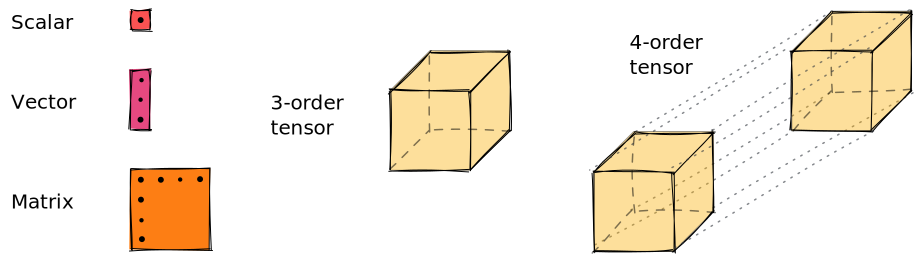

# Tensors.jl

A tensor $T$ of order[^1] $n$ is a multilinear[^2] application between $n$ vector spaces over a field $\mathcal{F}$.

[^1]: The _order_ of a tensor may also be known as _rank_ or _dimensionality_ in other fields. However, these can be missleading, since it has nothing to do with the _rank_ of linear algebra nor with the _dimensionality_ of a vector space. We prefer to use _order_.
[^2]: Meaning that the relationships between the output and the inputs, and the inputs between them, are linear.

```math
T : \mathcal{F}^{\dim(1)} \times \dots \times \mathcal{F}^{\dim(n)} \mapsto \mathcal{F}
```

In layman's terms, it is a linear function whose inputs are vectors and the output is a scalar number.

```math
T(\mathbf{v}^{(1)}, \dots, \mathbf{v}^{(n)}) = c \in \mathcal{F} \qquad\qquad \forall i, \mathbf{v}^{(i)} \in \mathcal{F}^{\dim(i)}
```

Tensor algebra is a higher-dimensional generalization of linear algebra, where scalar numbers can be viewed as _order-0 tensors_, vectors as _order-1 tensors_, matrices as _order-2 tensors_, ...

```@raw html

```

Letters are used to identify each of the vector spaces the tensor relates to.
In computer science, you would intuitively think of tensors as "_n-dimensional arrays with named dimensions_".

```math
T_{ijk}
```
